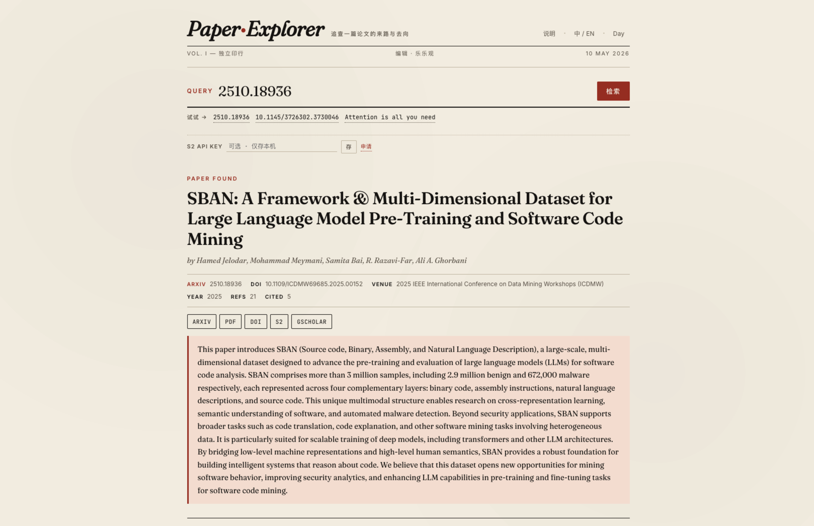
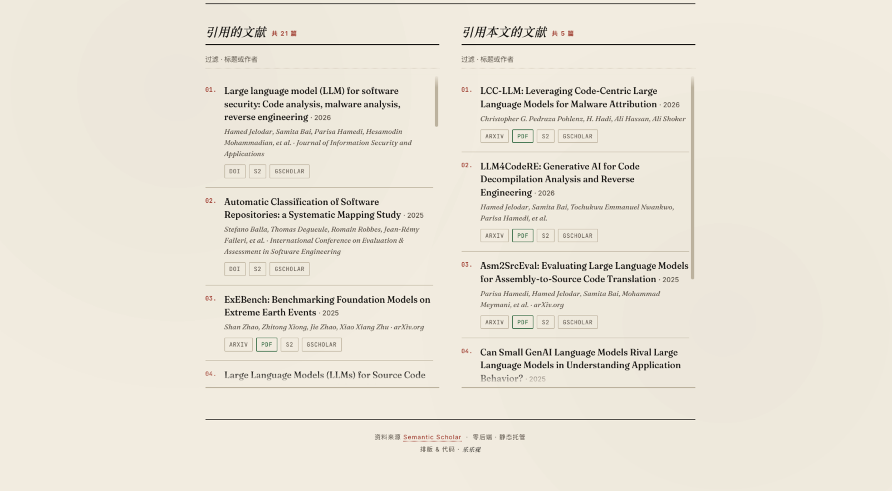

# Paper Explorer

> 粘贴一篇论文，看它引用了谁、又被谁引用。
> 每条直达 arXiv / PDF / DOI / Google Scholar。纯前端 · 零后端 · 报刊排版。





---

## 目录结构

```
paper_explorer_web/
├── index.html       # 单页 UI
├── app.js           # 前端逻辑（浏览器直连 Semantic Scholar）
├── api/
│   └── arxiv.js     # 可选：Vercel/Netlify serverless，用来代理 arXiv Atom API
├── vercel.json      # Vercel 配置
├── images/          # README 截图
└── README.md
```

## 本地预览

不需要任何依赖，直接开一个静态服务器即可：

```bash
cd paper_explorer_web
python3 -m http.server 8080
```

打开 http://localhost:8080 。注意纯静态预览时，`/api/arxiv` 不存在，标题搜索会
自动回退到 `https://r.jina.ai/...` 公共 CORS 代理（这是免费服务，偶尔慢）。

如果你想本地也跑 serverless，可以用 Vercel CLI：

```bash
npm i -g vercel
cd paper_explorer_web
vercel dev
```

## 部署

### Vercel（推荐）
```bash
cd paper_explorer_web
npm i -g vercel       # 如果还没装
vercel              # 按提示登录并绑定项目
vercel --prod       # 部署到生产
```

部署后，`/api/arxiv` 会自动作为 serverless function 提供，标题搜索不再依赖
外部代理。

### Cloudflare Pages / Netlify
直接拖拽或 git 绑定即可，这两家默认也支持 `functions/` 或 `api/` 目录，不过
命名略有差异：
- Cloudflare Pages：把 `api/arxiv.js` 改到 `functions/api/arxiv.js` 并换成 CF Workers 写法
- Netlify：重命名到 `netlify/functions/arxiv.js` 并导出 handler

最省事的做法：**只部署 `index.html` + `app.js`**，让标题搜索走 `r.jina.ai`
自动回退。arXiv ID / DOI 查询完全不受影响。

### GitHub Pages
纯静态最适合：
```bash
# 把 index.html + app.js 推到 main 或 gh-pages 分支根目录
# Settings → Pages → Source 选中分支即可
```

## Semantic Scholar API Key（可选但推荐）

匿名调用 `api.semanticscholar.org` 的速率限制大约 **1 req/s**，跑多了会 429。
申请 key：https://www.semanticscholar.org/product/api#api-key-form

拿到 key 后，打开网页 → 把 key 粘到输入框下方的 "API Key" 输入框 → 点"保存"。
key 只存在你本地浏览器的 `localStorage`，不会上传到任何服务器（因为这本身就
是纯前端应用）。

## 支持的输入

| 输入示例 | 说明 |
|---|---|
| `2506.06341` | arXiv 新格式 ID |
| `2506.06341v2` | 带版本号也行 |
| `https://arxiv.org/abs/1706.03762` | arXiv URL |
| `cs.CL/0105020` | arXiv 旧格式 |
| `10.3866/PKU.WHXB201112303` | DOI |
| `0216a58074f5e8cf6ae055f6fb3189dd6740229a` | Semantic Scholar 40 位 paperId |
| `Attention is all you need` | 纯标题（先用 arXiv 精确匹配，失败再走 S2 搜索） |

## 原理 & FAQ

**Q: 为什么不需要后端？**
Semantic Scholar 的 `api.semanticscholar.org` 显式返回
`Access-Control-Allow-Origin: *`，浏览器可以直接跨域调用。

**Q: 会被 S2 限流吗？**
匿名调用会。解决办法：
1. 填入 API Key（最干净）
2. 多等几秒再查第二篇
3. 同一篇论文的结果会在浏览器会话里缓存 1 小时，重复查询不耗配额

**Q: 数据没了怎么办？**
所有数据来自 Semantic Scholar Graph API 的实时响应，本应用不存储任何数据。
刷新页面即重置。
